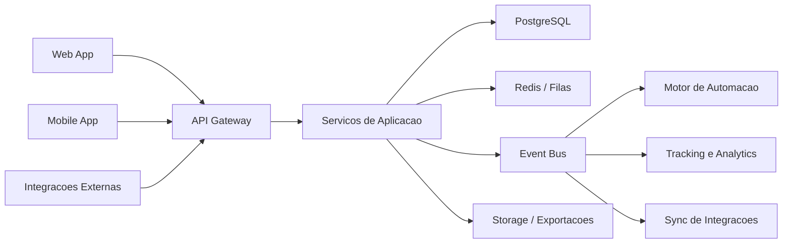

# Arquitetura do Sistema

## Posicionamento

PulseCRM e uma plataforma SaaS multiempresa desenhada para centralizar operacao comercial, atendimento, marketing de performance e automacao em uma unica camada de produto.

O produto tambem pode operar como edicao gratuita auto-hospedavel para pequenos times, grupos de amigos ou operacoes comerciais independentes.

## Principios arquiteturais

- Multi-tenant desde a origem, com isolamento por `tenant_id`
- Modulos desacoplados, mas unidos por eventos de dominio
- API-first para web, mobile e integracoes externas
- Observabilidade e auditoria nativas
- Seguranca por camadas, com LGPD, trilha de auditoria e controle de acesso fino
- Escalabilidade horizontal para mensagens, automacoes e relatorios

## Camadas

### 1. Experience Layer

- Aplicacao web responsiva para operacao comercial, gestao e administracao
- Aplicativo mobile ou PWA premium para vendedores e suporte
- Portal administrativo para configuracoes, billing e governanca

### 2. API and Application Layer

- Gateway REST
- Servicos de autenticacao, autorizacao e sessao
- Modulo de CRM: leads, contatos, empresas, negocios, atividades
- Modulo de automacao: fluxos, templates, regras, sequencias
- Modulo de comunicacao: WhatsApp, e-mail, inbox, tracking
- Modulo de agenda: tarefas, compromissos, calendar sync
- Modulo de analytics: KPIs, forecasts, performance e exportacoes
- Modulo de integracoes: Ads, ERP, webhooks, importacao e exportacao

### 3. Domain and Workflow Layer

- Regras de negocio por contexto delimitado
- Motor de automacao orientado a gatilhos e filas
- Distribuicao inteligente de leads
- Score dinamico de leads
- Regras de ownership e carteira

### 4. Data and Infrastructure Layer

- PostgreSQL para transacoes centrais
- Redis para cache, locks, fila e rate limiting
- Storage de arquivos para anexos, exportacoes e importacoes
- Lake operacional opcional para BI e analises historicas

## Contextos de dominio

### CRM Core

- leads
- contatos
- empresas
- clientes
- negocios
- pipeline e etapas
- interacoes e anotacoes

### Sales Operations

- tarefas
- lembretes
- agendas
- metas
- ranking
- carteira por vendedor ou equipe

### Engagement Automation

- templates
- campanhas
- fluxos automatizados
- condicoes, atrasos, janelas e gatilhos
- tracking de entrega, abertura, clique e resposta

### Integrations Hub

- Meta Ads Lead Ads
- Google Ads
- Google Calendar
- ERPs
- webhooks
- importacao/exportacao CSV e Excel

### Governance

- RBAC com permissoes granulares
- auditoria
- preferencia por tenant
- politicas de retencao e consentimento LGPD

## Arquitetura recomendada

## Escalabilidade

- Separar leitura analitica das cargas transacionais
- Usar filas para envio de mensagens, sincronizacoes e enriquecimento
- Particionar entidades volumosas por tenant e data quando necessario
- Introduzir event bus conforme o volume crescer
- Adotar workers dedicados para automacoes, integrações e relatórios pesados

## Estrategia de distribuicao gratuita

- edicao gratuita com deploy simples e baixo custo operacional
- onboarding por convite para compartilhar workspace com amigos e equipe
- arquitetura pronta para self-host ou deploy comunitario
- possibilidade de evoluir depois para planos pagos sem quebrar a base gratuita

## Seguranca e LGPD

- Criptografia em transito e em repouso
- mascaramento e classificacao de dados sensiveis
- consentimento e finalidade de uso de dados
- logs de acesso e alteracao de dados criticos
- segmentacao por tenant, equipe e carteira
- politicas de MFA, rotacao de tokens e expiracao de sessao

## Painel administrativo

- gestao de usuarios, equipes e perfis
- configuracoes de pipeline, tags, origem, score e SLA
- integracoes e credenciais
- billing e limites do plano
- templates, automacoes e regras de distribuicao
- logs de auditoria e saude da plataforma

## Estrutura de modulos e funcionalidades

### CRM

- cadastro completo de leads, contatos, empresas e clientes
- historico cronologico unificado
- score, tags, origem, status e owner
- importacao em lote e deduplicacao

### Pipeline

- multiplos pipelines
- etapas configuraveis com SLA
- probabilidades e forecast
- ganho, perda e motivo de perda

### Atendimento

- inbox por canal
- timeline de mensagens
- templates e respostas rapidas
- transferencias entre usuarios e times

### Automacao

- gatilhos por criacao, mudanca de etapa, inatividade, data e comportamento
- sequencias condicionais
- envio de WhatsApp e e-mail
- tarefas automaticas e escalonamentos

### Agenda

- tarefas, compromissos e follow-ups
- sincronizacao Google Calendar
- agenda por vendedor e equipe
- lembretes por canal

### Analytics

- dashboard executivo
- produtividade operacional
- funil por origem e campanha
- previsao de receita
- perdas e gargalos

### Integracoes

- Ads, ERP, webhooks e API publica
- conectores modulares
- trilha de sincronizacao e retry
